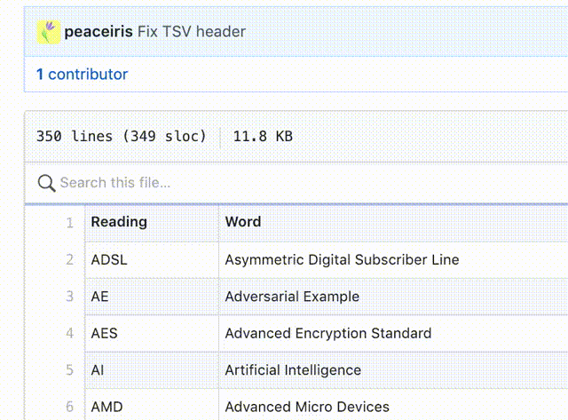

# Google日本語入力用のユーザー辞書(日英変換・英語略語展開)

## Table of Contents

クリックして目次を見る

<!-- START doctoc generated TOC please keep comment here to allow auto update -->
<!-- DON'T EDIT THIS SECTION, INSTEAD RE-RUN doctoc TO UPDATE -->

- [概要](#%E6%A6%82%E8%A6%81)
- [辞書の中身をちょっとだけ紹介](#%E8%BE%9E%E6%9B%B8%E3%81%AE%E4%B8%AD%E8%BA%AB%E3%82%92%E3%81%A1%E3%82%87%E3%81%A3%E3%81%A8%E3%81%A0%E3%81%91%E7%B4%B9%E4%BB%8B)
  - [edict-googleime.txt](#edict-googleimetxt)
  - [abbreviation.txt](#abbreviationtxt)
  - [day_month.txt](#day_monthtxt)
    - [英語曜日](#%E8%8B%B1%E8%AA%9E%E6%9B%9C%E6%97%A5)
    - [日本語曜日](#%E6%97%A5%E6%9C%AC%E8%AA%9E%E6%9B%9C%E6%97%A5)
    - [月](#%E6%9C%88)
- [辞書のインポート方法](#%E8%BE%9E%E6%9B%B8%E3%81%AE%E3%82%A4%E3%83%B3%E3%83%9D%E3%83%BC%E3%83%88%E6%96%B9%E6%B3%95)
  - [インポート](#%E3%82%A4%E3%83%B3%E3%83%9D%E3%83%BC%E3%83%88)
  - [アップデート](#%E3%82%A2%E3%83%83%E3%83%97%E3%83%87%E3%83%BC%E3%83%88)
- [使い方](#%E4%BD%BF%E3%81%84%E6%96%B9)
  - [edict-googleime.txt](#edict-googleimetxt-1)
  - [edict-googleime_us.txt](#edict-googleime_ustxt)
  - [edict-googleime_notrigger.txt](#edict-googleime_notriggertxt)
  - [abbreviation.txt](#abbreviationtxt-1)
  - [day_month.txt](#day_monthtxt-1)
- [Licence](#licence)
  - [CC BY-SA 3.0](#cc-by-sa-30)
  - [MIT Licence](#mit-licence)
- [References](#references)

<!-- END doctoc generated TOC please keep comment here to allow auto update -->

## 概要

9万8千語が収録されている [The EDICT Dictionary File] を利用したIME用の辞書である
[IME和英辞書 - EDICT for MS-IME 2] に若干の修正を加え､
[Google日本語入力]に対応させたものです｡

- 略語を収録した辞書([abbreviation.txt])
- その他便利な辞書

も追加しています。

## 辞書の中身をちょっとだけ紹介

### edict-googleime.txt

| 変換前      | 変換後               |
|-------------|----------------------|
| @じしょ     | dictionary           |
| @こくさい   | international        |
| @こくさいか | internationalization |
| @もくじ     | table of contents    |
| @ぶんごう   | literary master      |

USキーボード向けに、変換トリガーが `@` ではなく `\` である辞書も用意しています。

### abbreviation.txt

**290** 以上の単語が収録されています。

| GitHub上で中身を検索できます |
|:----|
| [tsv/](./tsv) ディレクトリの中の `tsv` 拡張子ファイルの中身を GitHub 上で以下のように検索することができます。どんな短縮語が収録されているか確認するのに役立ちます。 |

- [GitHub上で単語を検索](./tsv/abbreviation.tsv)

| 変換前 | 変換後                             |
|--------|------------------------------------|
| TOC    | Table of Contents                  |
| AWS    | Amazon Web Services                |
| GCP    | Google Cloud Platform              |
| GDPR   | General Data Protection Regulation |
| OSS    | Open Source Software               |
| CNN    | Convolutional Neural Netwok        |

### day_month.txt

- [GitHub上で単語を検索](./tsv/day_month.tsv)

#### 英語曜日

| 変換前 | 変換後1 | 変換後2   |
|--------|---------|-----------|
| d1     | Mon.    | Monday    |
| d2     | Tue.    | Tuesday   |
| d3     | Wed.    | Wednesday |
| d4     | Thu.    | Thursday  |
| d5     | Fri.    | Friday    |
| d6     | Sat.    | Saturday  |
| d7     | Sun.    | Sunday    |

#### 日本語曜日

| 変換前 | 変換後 |
|--------|--------|
| y1     | 月曜日 |
| y2     | 火曜日 |
| y3     | 水曜日 |
| y4     | 木曜日 |
| y5     | 金曜日 |
| y6     | 土曜日 |
| y7     | 日曜日 |

#### 月

| 変換前 | 変換後    |
|--------|-----------|
| m1     | January   |
| m2     | February  |
| m3     | March     |
| m4     | April     |
| m5     | May       |
| m6     | June      |
| m7     | July      |
| m8     | August    |
| m9     | September |
| m10    | October   |
| m11    | November  |
| m12    | December  |

## 辞書のインポート方法

### インポート

1. 最新の辞書ファイルをダウンロード
    - USキーボードの方は [edict-googleime_us.txt]
    - JISキーボードの方は [edict-googleime.txt]
    - 略語の辞書は [abbreviation.txt]
    - 曜日・月の辞書は [day_month.txt]
1. Google日本語入力の `辞書ツール` を開く
1. `管理` をクリック
1. `新規辞書にインポート` をクリック
1. `ファイルを選択` からダウンロードしたファイルを選択
1. お好きな `辞書名` をつける
1. `インポート` をクリック

Download [edict-googleime_us.txt] or [edict-googleime.txt] and import using Dictionary Tool of Google Japanese Input.

### アップデート

1. 最新の辞書ファイルをダウンロード
    - USキーボードの方は [edict-googleime_us.txt]
    - JISキーボードの方は [edict-googleime.txt]
    - 略語の辞書は [abbreviation.txt]
    - 曜日・月の辞書は [day_month.txt]
1. Google日本語入力の `辞書ツール` を開く
1. アップデートする辞書を選択する
1. `管理` をクリック
1. `選択した辞書にインポート` をクリック
1. `ファイルを選択` からダウンロードしたファイルを選択
1. `インポート` をクリック

リポジトリをクローンしている方は `git pull origin master` で最新の辞書データをダウンロードできます。

## 使い方

### edict-googleime.txt

- トリガー文字は `@`
- `@じしょ` と入力することで `dictionary` に変換することができます。
- JISキーボード向け

### edict-googleime_us.txt

- トリガー文字は `\`
- `\じしょ` と入力することで `dictionary` に変換することができます。
- USキーボード向け

### edict-googleime_notrigger.txt

- トリガー文字はなし
- `じしょ` と入力することで `dictionary` に変換することができます。

### abbreviation.txt

- トリガー文字はなし
- `CPU` と入力することで `Central Processing Unit` に変換することができます。

### day_month.txt

- トリガー文字はなし
- `d1` と入力することで `Monday` に変換することができます。
- `d1` と入力することで `Mon.` に変換することができます。
- `y1` と入力することで `月曜日` に変換することができます。
- `m1` と入力することで `January` に変換することができます。

## Licence

### [CC BY-SA 3.0](http://creativecommons.org/licenses/by-sa/3.0/deed.ja)

- このライセンスは次に挙げる辞書ファイルにのみ適用されます。
    - `edict-googleime.txt` from [kyontan/edict-for-google-ime]
    - `edict-googleime_us.txt` 上を継承

### MIT Licence

残りのファイル群に [MIT Licence](./LICENSE) が適用されます。

## References

- peaceiris
    - [Github](https://github.com/peaceiris)
    - [Twitter](https://twitter.com/piris314)
    - [Google日本語入力で日本語を英語に変換するための辞書](https://www.p-iris.com/blog/english/google_ime_dictionary/)
- EDICT
    - Japanese-English Electronic DICTionary
    - Original: [The EDICT Dictionary File]
- [Google日本語入力]

[Jump to TOC :small_red_triangle:]

<!-- External References -->
[Google日本語入力]: https://www.google.co.jp/ime/
[The EDICT Dictionary File]: http://www.edrdg.org/jmdict/edict.html
[kyontan/edict-for-google-ime]: https://github.com/kyontan/edict-for-google-ime
[IME和英辞書 - EDICT for MS-IME 2]: http://www.nurs.or.jp/~nagadomi/edictime2/

<!-- Internal References -->
[edict-googleime_us.txt]: https://raw.githubusercontent.com/peaceiris/google-ime-dictionary/master/edict-googleime_us.txt
[edict-googleime.txt]: https://raw.githubusercontent.com/peaceiris/google-ime-dictionary/master/edict-googleime.txt
[abbreviation.txt]: https://raw.githubusercontent.com/peaceiris/google-ime-dictionary/master/abbreviation.txt
[day_month.txt]: https://raw.githubusercontent.com/peaceiris/google-ime-dictionary/master/day_month.txt
[Jump to TOC :small_red_triangle:]: #table-of-contents
